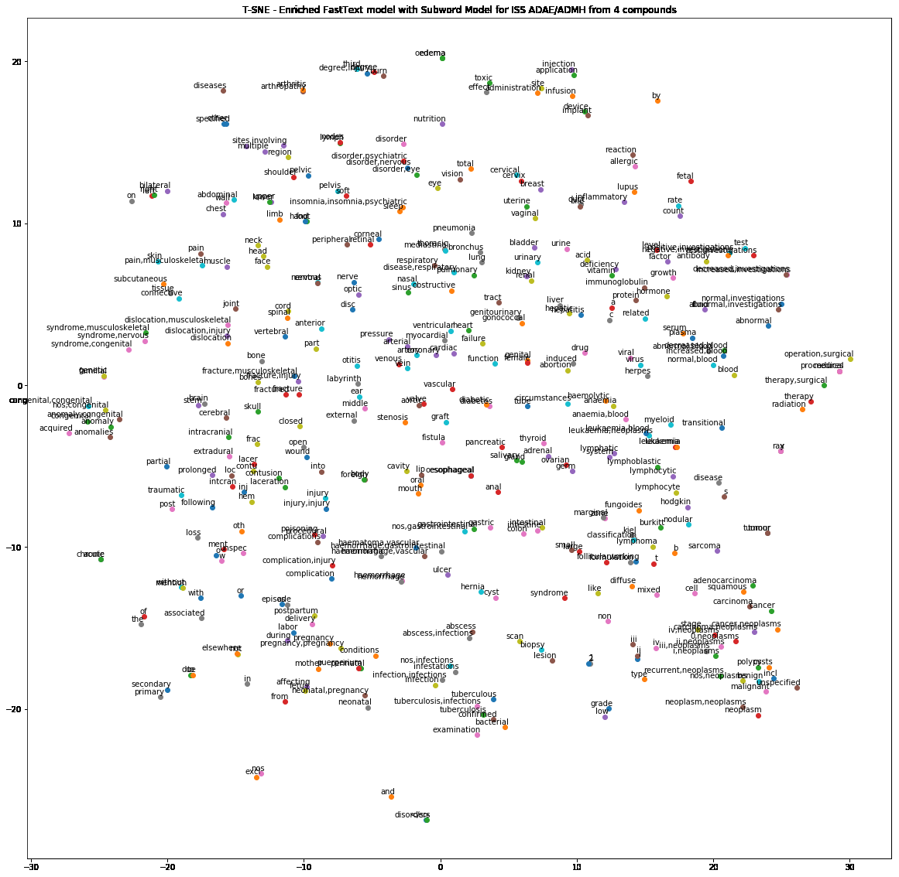
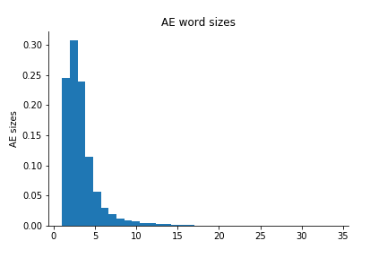
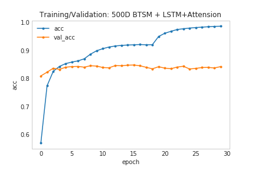
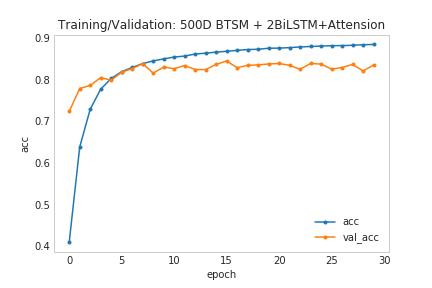
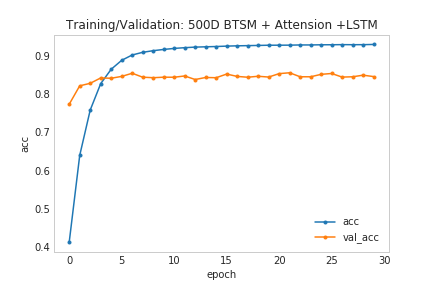
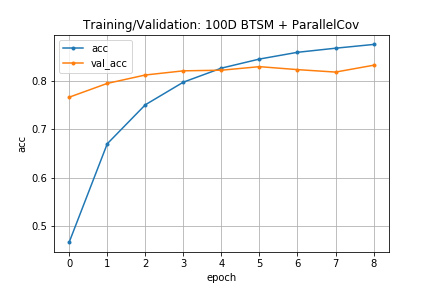

# meddra_coding
Repo for MedDRA coding results

## Word Embeddings
BlazingText with Subword Models (BTSM) were built on MedDRA 4-22 & anonymized AE+MH data
1. 100 dimension model
2. 500 dimension model

3. 100 dimention model with artificial augmentation
4. 500 dimention model with artificial augmentation

## MedDRA coding models

| Methods                               | Loss  | Accuracy | Precision | Recall | F1    |
| ------------------------------------- | ----- | -------- | --------- | ------ | ----- |
| m0 500D BTSM + LSTM+Attension         | 0.665 | 0.917    | 0.929     | 0.917  | 0.920 |
| m1 500D BTSM + 2BiLSTM Attension      | 0.889 | 0.928    | 0.937     | 0.928  | 0.930 |
| m2 500D BTSM + Attension +LSTM        |       |          | 0.940     | 0.924  | 0.930 |
| m3 100D BTSM + Attension +Conv+biLSTM | 0.610 | 0.935    | 0.944     | 0.935  | 0.935 |
| m0 100D BTSM + 2BiLSTM+Attension      | 0.557 | 0.926    | 0.939     | 0.927  | 0.928 |
|                                       |       |          |           |        |       |

with MedDRA 4-22
1. 500D BTSM + LSTM+Attension

 

2. 500D BTSM + 2BiLSTM Attension

3. 500D BTSM + Attension+LSTM

4. 100D BTSM + Attension + 3 parallel conv +biLSTM +dense

Earlystop 'val_loss' min_delta=0 patientce 3

3. 100D BTSM + BiLSTM+Attension
4. 100D BTSM + LSTM+Dense+Attension
5. 500D BTSM + LSTM+Attension
6. 500D BTSM + Attension+LSTM
7. 500D BTSM + 2BiLSTM+Attension
8. 500D BTSM + LSTM+Dense+Attension

without MedDRA 4-22
